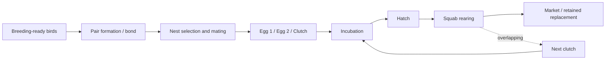

# Domain Baseline

> **Project:** Pigeon Farm Management System  
> **Scope:** Commercial Meat Pigeon / Squab Production  
> **Phase:** Phase 1 — Domain Research  
> **Status:** Consolidated in Phase 1C — Awaiting User Review  
> **Date:** 2026-08-17  
> **Boundary:** This is a domain reference. It is not a database model, software entity model, workflow implementation, status enum specification, or architecture document.

---

## 1. Commercial Production Model

Commercial squab production is a repeated breeding-and-rearing operation whose primary output is the young pigeon produced for meat. The commercial system is fundamentally different from broiler production because squabs are highly dependent on parental care during early life and both parents participate in incubation and feeding.

### Established Domain Facts

- Squabs are altricial/dependent during early life.
- Both male and female pigeons participate in incubation and parental care.
- Both parents can produce crop milk.
- The breeding pair is a central operational production unit.
- Two eggs per clutch is the dominant domestic-pigeon pattern.
- Natural incubation is commonly around 17–20 days.
- Production can overlap: a pair may rear one brood while beginning/incubating the next clutch.

### Context-dependent Findings

Commercial production can operate through communal loft/dovecote/colony housing, controlled pair cages, or more intensive variants involving artificial incubation, early separation, artificial feeding, or fostering. None of these should be assumed to be the universal target production model.

---

## 2. Farm Population

The commercial population is operationally heterogeneous and may include:

- breeding males,
- breeding females,
- active breeding pairs,
- replacement/pre-breeding birds,
- dependent squabs,
- growing birds retained beyond market age,
- isolated/sick/quarantine birds,
- birds removed by sale, culling, retirement, or mortality.

A useful domain trajectory is:

**Hatch → dependent squab → market bird OR retained young bird → replacement candidate → breeding-ready bird → breeding pair → repeated production → re-pair / remove / sell / cull / retire / mortality.**

This is descriptive only and must not be copied into a software state machine.

---

## 3. Breeding Pair

A breeding pair normally consists of one male and one female functioning together reproductively. Both parents participate in the reproductive workload, making pair-level performance meaningful for production analysis.

Important distinction:

- **Biological Pair:** actual socially/reproductively bonded birds.
- **Operational Breeding Pair:** the male and female currently managed by the farm as a productive unit.

These usually align in controlled housing but can diverge through re-pairing, parent loss, fostering, uncertain parentage, or communal housing.

---

## 4. Pair Bond

Domestic pigeons show persistent pair bonding and biparental cooperation. Pair membership is nevertheless not immutable. Re-pairing may follow mate loss, deliberate separation, infertility, poor performance, health removal, or culling.

No universal commercial rule was established for:

- how long pairing should take,
- when a pairing attempt has failed,
- how long to wait after mate loss,
- how many failed clutches justify re-pairing,
- whether the male, female, or both should be replaced.

These are field-validation items.

---

## 5. Nesting

Nesting is production infrastructure because the nest supports laying, incubation, and squab rearing.

A **Double Nest System** is well supported in controlled/intensive pigeon production and enables one nest to contain older squabs while another is used for a subsequent clutch.

Nest ownership differs by housing model:

- individual pair cages provide clearer pair–nest attribution;
- communal systems may involve competition, intrusion, nest switching, or uncertain parentage.

The relationship between pair and nest must therefore remain context-dependent.

---

## 6. Eggs & Clutches

### Domain definition — Clutch

A **clutch** is the eggs produced by one female as one discrete laying episode before the next reproductive laying interval.

Important distinctions:

- Egg laid ≠ clutch complete.
- Clutch complete ≠ sustained incubation started.
- An egg belongs to a clutch from the time it is laid.
- A completed one-egg laying episode can still be a one-egg clutch.
- Individual egg outcomes and overall clutch outcome are separate concepts.

The dominant pattern is two eggs, commonly laid about two days apart, but exceptions must remain possible.

---

## 7. Incubation

Natural incubation is biparental and commonly falls around **17–20 days**, with approximately 18 days repeatedly reported.

The exact incubation **start anchor** is not globally standardized in the reviewed sources. First egg, second egg/clutch completion, and sustained incubation are related but distinct events.

Future analysis should preserve observed egg dates and hatch dates rather than assume one universal calculation anchor.

Candling is a real fertility/development-checking method; useful visible information is commonly available around incubation days 5–7 where candling is practiced. Routine adoption in Egyptian commercial farms remains unverified.

---

## 8. Hatching

Hatching occurs near the end of effective incubation. Eggs within a clutch need not hatch at exactly the same moment.

Possible outcomes include:

- successful hatch,
- infertility/no development,
- embryonic death,
- dead-in-shell/failure to complete hatch,
- cracked/broken egg,
- missing/displaced egg,
- abandonment/inadequate incubation,
- transferred/fostered egg,
- unknown outcome.

These are domain outcomes, not approved software enums.

---

## 9. Squab Rearing

Newly hatched squabs are strongly dependent on parents for food and warmth. Crop milk is central in the earliest period, followed progressively by mixed regurgitated feed.

A practical evidence-based age map is:

- **Day 0:** highly dependent hatchling.
- **Days 1–7:** crop milk central; very rapid growth.
- **Days 7–14:** rapid growth continues; mixed parental feed increases.
- **Days 14–21:** feathering and body mass advance; still parent-dependent.
- **Days 21–28:** common pre-weaning/market region in many meat systems.
- **~28 days onward:** increasing feeding independence in traditional systems.

Age-stage labels are descriptive; no universal commercial status vocabulary was found.

---

## 10. Weaning & Market Readiness

The following must remain distinct:

- **Early Separation:** management removal from parents before conventional natural rearing is complete.
- **Weaning:** transition toward independent feeding; research sometimes uses the term for managed separation even when artificial feeding continues.
- **Market Readiness:** commercial decision that the squab meets buyer/farm requirements.

Therefore:

**Early Separation ≠ Physiological Weaning ≠ Market Readiness.**

The common 21–28 day region is a useful natural-production reference but is not an approved Egyptian market specification.

---

## 11. Overlapping Cycles

This is a core Phase 1 conclusion.

Pigeon reproductive activity is not safely described as one non-overlapping linear cycle.

A pair may simultaneously have:

- **Cycle A:** dependent squabs being reared;
- **Cycle B:** nest preparation, egg laying, or incubation.

A simplified domain view is:

This diagram is descriptive and must not be interpreted as a future database or software state model.

---

## 12. Replacement & Culling

**Replacement Bird:** a bird retained for possible future entry into the breeding population.

**Culling:** intentional removal from active breeding/production because the bird or pair no longer meets farm criteria. Culling is not synonymous with mortality, sale, or retirement.

Sexual maturity and operational breeding readiness are different. Biological maturity is commonly seen in the broad 5–7+ month region, but commercial admission depends on strain, growth, body condition, health, sex confirmation, mate availability, and farm strategy.

No universal culling/replacement thresholds were established in Phase 1.

---

## 13. Environment & Seasonality

The evidence does not support a universal claim that pigeons must biologically stop reproduction during summer.

However, Egyptian evidence supports a real **heat-stress effect** that can reduce reproductive performance such as egg output, fertility, and hatchability.

Therefore:

- non-seasonal breeding biology and summer production depression can coexist;
- heat, humidity, ventilation, water, feed, housing, strain, and management must be considered together;
- molt can overlap with breeding and should be treated as a production/physiological modifier rather than an automatic total shutdown.

---

## 14. Egyptian Context

### What We Know

Egyptian evidence reviewed in Phase 1 includes:

- commercial mud dovecotes and wooden lofts in a Sharqia survey;
- individual pair cages in Egyptian experimental/commercial contexts;
- Egyptian Baladi/Local Egyptian pigeons;
- Zagel;
- White Mirthys;
- incubation around 17.7–18.0 days in a comparative Egyptian strain study;
- significant strain differences in 28-day growth;
- substantially different hatch-to-next-lay intervals among strains;
- a 2025 Egyptian commercial-farm early-separation study;
- documented summer heat-stress effects on reproduction.

### What We Think We Know — Context-dependent

- Double nesting is operationally important and used in Egyptian research systems, but its prevalence across target farms is unknown.
- Individual identification is technically established, but actual Egyptian commercial practice may rely on bird, pair, nest, cage, or mixed identification.
- Early separation/artificial feeding can increase parent reproductive throughput but is not established as common Egyptian commercial practice.

### What We Still Need to Ask Egyptian Farms

- dominant target housing models in 2026;
- actual farm sizes and production organization;
- actual market age and weight by customer/region;
- how breeders and pairs are identified;
- whether Egg 1 and Egg 2 are recorded separately;
- hatch prediction convention;
- candling use;
- double-nest prevalence;
- replacement and culling thresholds;
- re-pairing practice;
- fostering practice;
- actual summer slowdown and mitigation;
- current record-keeping tools and granularity.

---

## 15. Key Benchmarks

| Benchmark | Phase 1 Classification | Reference Finding | Interpretation |
|---|---|---|---|
| Clutch size | Stable Biological Range | usually ~2 eggs | Strong baseline; exceptions possible. |
| Within-clutch egg interval | Stable Biological Range | ~2 days / ~48 h commonly | Strong; retain actual egg dates. |
| Incubation duration | Stable Biological Range | ~17–20 days | Strong; anchor remains contextual. |
| Candling timing | Research/Practice Reference | ~day 5–7 where practiced | Method established; farm adoption not universal. |
| Sexual maturity | Context-dependent Benchmark | ~5–7+ months | Breed/growth/definition dependent. |
| Breeding readiness | Requires Field Validation | no universal threshold | Must not equal sexual maturity automatically. |
| Natural market/weaning region | Context-dependent Benchmark | ~21–28 days; some reports later nest departure | Buyer, strain and production system matter. |
| Market weight | Requires Egyptian Field Validation | research weights vary strongly by strain | Research weight is not market specification. |
| 28-day live weight | Research-specific Observation | Local Egyptian, Zagel, White Mirthys differed materially | Use only with source population context. |
| Hatch-to-next-lay | Context-dependent Benchmark | ~19.5–31 d in cited Egyptian strain study; can be shorter with early separation | Strong variability. |
| Reproductive/egg cycle length | Context-dependent Benchmark | widely variable across definitions/systems | Never use one universal duration. |
| Squabs per pair/year | Context-dependent Benchmark | order-of-magnitude references exist | Management, mortality and definitions matter. |
| Fertility | Context-dependent Benchmark | percentage varies by study | Preserve denominator and context. |
| Hatchability | Context-dependent Benchmark | percentage varies by study | Preserve eggs-laid vs fertile-eggs denominator. |
| Squab mortality/survival | Context-dependent Benchmark | strongly affected by rearing method | Must segment by age and pathway. |
| Summer performance | Requires Egyptian Field Validation | heat stress lowers reproduction | No universal decline percentage. |

---

## 16. Exceptions

| Exception / Non-standard Scenario | Evidence Level | Operational Impact | Field Validation? | Future Analysis Area |
|---|---|---|---|---|
| One-egg clutch | Strong/biologically supported | clutch does not require two surviving eggs | No for existence; yes for frequency | Phase 3 |
| Extra/uncommon clutch-size deviation | Moderate | affects expectation and attribution | Yes for frequency | Phase 3 |
| Broken/cracked egg | Established | changes clutch outcome | No | Phase 3 |
| Missing/displaced egg | Established operational scenario | uncertain outcome/parentage | Yes for local frequency | Phase 2/3 |
| Egg outside intended nest | Moderate/industry practice | attribution/nest-control problem | Yes | Phase 2/3 |
| Abandoned egg/nest | Established | hatch failure / restart possibility | Yes for response | Phase 3 |
| Infertile egg/clutch | Established | reproductive failure | No | Phase 3 |
| Embryonic death | Established | hatchability/reproductive diagnosis | No | Phase 3/4 |
| Dead-in-shell | Established | late hatch failure | No | Phase 3/4 |
| Asynchronous hatch | Established | sibling age/size difference | No | Phase 3 |
| Squab mortality | Established | production loss and parent workload change | No | Phase 3/4 |
| Mate death | Established | pair broken; dependent squabs affected | No | Phase 2/3/4 |
| Pair separation / re-pairing | Established practice; thresholds variable | production interruption/history complexity | Yes for rules | Phase 2/3 |
| Fostered egg | Established husbandry technique | biological parents and rearing parents differ | Yes for prevalence | Phase 2/3 |
| Fostered squab | Established; Egyptian evidence | parental-care responsibility changes | Yes for prevalence | Phase 2/3 |
| Nest switching/competition | Moderate; more relevant to communal systems | attribution and parentage uncertainty | Yes | Phase 2 |
| Early artificial separation | Established specialized pathway | radically changes parent/squab timelines | Yes for prevalence | Phase 3 |
| Artificial incubation/feeding | Established specialized pathway | decouples natural parental workflow | Yes for prevalence | Phase 3/4 |

---

## 17. Terms That Must Remain Flexible

### Production Cycle

Possible meanings include pairing cycle, laying-to-laying interval, clutch cycle, incubation period, hatch-to-next-lay interval, full reproductive cycle, or a farm-defined production interval.

**Required future wording:** always name the exact anchor, e.g. `first-egg-to-next-first-egg`, `hatch-to-next-lay`, or `clutch-to-clutch`, rather than using “production cycle” alone in a calculation.

### Weaning

Can mean physiological feeding independence or management separation. Always state which meaning is intended.

### Market Readiness

Buyer/farm criterion, not a biological age status. Keep age, weight, feathering, live/dressed sale and customer requirements explicit.

### Hatchability

Can use different denominators. Always state whether calculated from all eggs set/laid or fertile eggs.

### Fertility

Requires explicit denominator and observation method.

### Loft / Dovecote / Colony

These housing terms do not describe one standardized physical design. Future farm-structure work must capture actual physical/operational form.

### Breeding Readiness

A management evaluation distinct from biological sexual maturity.

---

## 18. Field Validation Required

### Farm Owner / Farm Manager — Highest Priority

| Question ID | Question | Why It Matters | Future Module | Priority |
|---|---|---|---|---|
| OQ-001 | Which housing/production models represent the target commercial farms? | Determines real workflows. | Farm Structure | Critical |
| OQ-002 | Is practical tracking individual, pair, group/location, or mixed? | Determines information granularity. | Pigeon/Pair Management | Critical |
| OQ-003 | What does the farm call a production cycle and what dates does it record? | Prevents false cycle definition. | Production | Critical |
| OQ-009 | What is recorded today on paper/Excel/apps? | Shows actual workflow and adoption needs. | System Analysis/MVP | High |
| OQ-014 | Is Double Nest actually used and in which housing systems? | Affects nest and overlap workflow. | Farm Structure/Production | Critical |
| OQ-016 | What identification method is actually used? | Affects traceability. | Pigeon/Pair Management | High |
| OQ-017 | How are replacements chosen/admitted? | Defines population flow. | Pigeon Management | High |
| OQ-018 | What makes a pair weak enough to review/re-pair/cull? | Defines production decisions. | Pair/Performance | High |
| OQ-019 | How much does summer slow production and how is it managed? | Needed to interpret performance. | Environment/Performance | High |
| OQ-021 | What happens after one parent dies with dependent squabs? | Defines emergency husbandry. | Pair/Squab/Health | High |

### Experienced Pigeon Breeder

- pairing acceptance/failure signs and normal practical timing;
- re-pairing methods and delay;
- candling habits;
- fostering practices;
- handling abnormal clutches and nest switching;
- practical meaning of local Arabic terms.

### Animal Production Specialist

- breeder-entry criteria;
- interpretation of strain/body-weight differences;
- performance benchmark definitions;
- environmental effects and valid comparison methods;
- distinction between research observations and commercial thresholds.

### Veterinarian

- health factors that interrupt reproduction;
- interpretation of embryonic mortality/dead-in-shell where veterinary diagnosis is required;
- quarantine/health isolation implications (details deferred to Phase 4).

### Market / Trader

| Question ID | Question | Why It Matters | Future Module | Priority |
|---|---|---|---|---|
| OQ-015 | What age/weight/form defines a marketable squab by customer type and region? | Market readiness cannot be inferred from research age alone. | Production/Sales | Critical |

### Specialist / Farm Owner — Intensive-path Validation

| Question ID | Question | Why It Matters | Future Module | Priority |
|---|---|---|---|---|
| OQ-020 | Are artificial incubation, early separation, and artificial feeding commercially used in the target market? | Could create a materially different lifecycle. | Production | High |

---

## 19. Domain Conclusions

### A. Established Domain Facts

1. Squabs are dependent young and natural production relies heavily on biparental care.
2. Both parents incubate and feed young; both can produce crop milk.
3. The breeding pair is a central production unit.
4. Two eggs is the dominant clutch pattern.
5. Egg laying, clutch completion, sustained incubation and hatch are distinct events.
6. Natural incubation is commonly about 17–20 days.
7. Overlapping reproductive activity is real and can place squab rearing and a new clutch in parallel.
8. Double nesting is a documented mechanism supporting overlap.
9. Failed reproductive attempts do not necessarily consume the same time as successful full rearing.
10. Parent loss can directly affect dependent squabs and may lead to fostering/hand rearing.

### B. Context-dependent Facts

- age/weight of breeding readiness;
- cycle length;
- hatch-to-next-lay interval;
- market age/weight;
- growth curve;
- fertility/hatchability percentages;
- annual output per pair;
- summer performance;
- housing productivity;
- early-weaning outcomes.

### C. Common Industry Practices

- controlled pair assignment in pair-cage systems;
- double nests in many controlled production systems;
- leg bands, pair/cage/nest identifiers;
- candling where practiced;
- fostering or transfer in selected circumstances;
- record keeping at pair/egg/hatch/squab level in more controlled operations.

### D. Egyptian-context Findings

Egyptian evidence supports the core biology while also demonstrating real variation by strain, housing, heat, parental load, and management intervention. Egypt therefore cannot safely inherit one foreign industrial benchmark as the system default.

### E. Requires Field Validation

Housing prevalence, market specification, identification, local pairing/re-pairing rules, double-nest prevalence, breeder-entry rules, current records, summer slowdown, culling thresholds, candling, fostering, and early-weaning adoption.

### F. Unresolved / Conflicting Evidence

Most apparent contradictions are now classified as **context-dependent**, not irreconcilable. Remaining unresolved items require either an explicit future metric definition or Egyptian field validation.

---

# Domain Confidence Matrix

| Topic | Conclusion | Evidence Level | Egyptian Evidence | Field Validation Needed | Impact on Future System |
|---|---|---|---|---|---|
| Squab parental dependency | Core biological fact | High | Yes | No | High |
| Biparental incubation/care | Core biological fact | High | Yes | No | High |
| Pair as production unit | Strong operational fact | High | Yes | No for concept; yes for farm practice | High |
| Pair bond | Strong biological fact | High | Partial | Yes for management rules | High |
| Two-egg clutch | Dominant biological pattern | High | Yes/consistent | No for baseline | High |
| Egg interval | ~2 days commonly | High | Compatible | Low | Medium |
| Incubation duration | ~17–20 d | High | Strong | Low | High |
| Incubation anchor | not universally defined | Moderate | Limited | Yes/definition needed | High |
| Candling | valid method | Moderate-High | limited commercial evidence | Yes | Medium |
| Crop milk | core early-life biology | High | Yes/compatible | No | High |
| Market age | context-dependent | High evidence of variability | Partial | Yes | High |
| Market weight | context-dependent | High evidence of variability | Research weights only | Yes | High |
| Double nest | documented operational mechanism | High | Yes in research | Yes for prevalence | High |
| Overlapping cycles | core production reality | High | Yes | No for existence | Very High |
| Hatch-to-next-lay | strongly variable | High | Strong strain data | Yes for target farms | High |
| Early separation | specialized alternate pathway | High | Yes, commercial experiment | Yes for prevalence | High |
| Replacement criteria | farm-specific | Moderate | Limited | Yes | High |
| Culling threshold | farm-specific | Moderate | Limited | Yes | High |
| Heat stress | lowers reproduction | High | Strong | Yes for magnitude | High |
| Mandatory summer shutdown | not supported | Moderate-High | evidence argues against simplistic rule | Yes for local operational pattern | Medium |
| Housing model superiority | no universal answer | High evidence of context | Yes | Yes | Very High |
| Individual identification practice | technically established | Moderate | limited current commercial data | Yes | High |

---

# Evidence Quality Review

| Source ID | Source Type | Country / Context | Population / System | Main Information Used | Reliability | Limitations | Relevance to Egyptian Commercial Farms |
|---|---|---|---|---|---|---|---|
| SRC-001 | FAO technical husbandry reference | International | general pigeon keeping/production | clutch, incubation, crop milk, market region, double nest/overlap | High | broad/older; not Egypt-specific | High for biology; Moderate for practice |
| SRC-002 | Peer-reviewed experiment | Egypt | White Mirthys commercial farm, pair cages | early separation, weights, mortality, cycle timing, two nests | High | one strain/system; experimental intervention | Very High |
| SRC-003 | Peer-reviewed review | International | domestic pigeon | crop milk, dependency, maturity context | High | review/general biology | High |
| SRC-004 | Peer-reviewed breeding-cycle review | International | domestic pigeon | pair bond, biparental care, two eggs, seasonality, intensive context | High | broad review, not market survey | High |
| SRC-005 | Peer-reviewed experiment | Egypt | Egyptian Baladi | parent loss, fostering, housing, two nests, incubation | High | experimental conditions | Very High |
| SRC-006 | Peer-reviewed production/nutrition research | Egypt/regional authors | breeding pigeons | production metrics, fertility, hatchability, growth/economics | High | treatment-specific | High for metric structure |
| SRC-007 | Peer-reviewed socio-economic survey | Egypt — Sharqia | family, mud dovecote, wooden loft | housing models, commercial purpose/economics | Medium-High | regional and 2016; economics outdated | Very High structurally |
| SRC-008 | Doctoral production study | Philippines | pair cages vs communal fly-pen | housing productivity, maturity, incubation | Medium | historical/non-Egyptian | Moderate |
| SRC-009 | Indexed record-keeping report | research colony | pigeon breeding colony | bands, parent/hatch/location/health records | Medium-High | colony, not meat-farm study; historical | Moderate |
| SRC-010 | Peer-reviewed experiment | Egypt | pigeons under summer heat stress | egg output, fertility, hatchability, heat effects | High | specific experimental conditions | Very High |
| SRC-011 | Peer-reviewed experiment | China/controlled | White King | photoperiod and reproductive performance | High | specific strain/program | Moderate; principle relevant |
| SRC-012 | Egyptian journal study | Egypt | Local Egyptian, Zagel, White Mirthys | growth, incubation, hatch-to-next-lay strain differences | Medium-High | study population; hosted copy | Very High |
| SRC-013 | University repository research | Indonesia | intensive local pigeons | production interval, fertility, cage production | Medium | local/historical context | Moderate-Low for direct benchmark |
| SRC-014 | Peer-reviewed production study | controlled/summer | breeding pigeons and squabs | practical performance measures | High | diet/condition-specific | High for measure definitions |
| SRC-015 | Veterinary production study | Egypt | Baladi pairs | parent load, behavior/performance | Medium-High | experimental load treatments | High |
| SRC-016 | Peer-reviewed study | 2026 controlled breeding | 900 breeding pairs | two-egg pattern, ~2-day oviposition interval, age effects | High | study population may differ from Egypt | High for egg rhythm |
| SRC-017 | Peer-reviewed genetics/review | international domestic pigeon | domestic pigeon biology | maturity, incubation, biparental care, foster/egg removal context | High | not commercial-market focused | High for biology |
| SRC-018 | Peer-reviewed engineering/reproduction study | pigeon eggs | incubation/candling | visual fertility detection around day 5–7 | High for method | technology study; routine farm use unknown | Moderate |
| SRC-019 | Direct pigeon study | historical Japan archive | pigeons | molt/reproduction interaction | Medium | 1949; historical | Low-Moderate |
| SRC-020 | Peer-reviewed field biology | feral rock pigeons | molt phenology | annual molt timing | High for molt | feral, not meat-farm context | Low-Moderate |
| SRC-021 | Peer-reviewed biochemical study | domestic pigeon | crop milk/rearing period | early crop-milk dominance and feed transition | High | biochemical rather than farm-management study | High for biology |

---

# Biological vs Management Events

## Biological Events

- courtship/mating behavior,
- egg laid,
- embryo development,
- hatch,
- crop-milk production/feeding,
- squab growth,
- sexual maturity,
- molt,
- illness/death.

## Management Events

- birds deliberately paired/separated,
- bird transferred between locations,
- nest assigned/provided,
- egg checked/candled,
- egg/squab fostered or transferred,
- squab weighed,
- squab separated/weaned,
- squab marketed,
- bird selected as replacement,
- pair reviewed,
- breeder culled/retired/sold.

These remain real-world domain events, not software Domain Events.

---

# Observable vs Inferred Information

## Directly Observable

Egg present, hatch observed, bird present/missing/dead, mating observed, nest occupied, egg broken, squab present/dead, pair aggression, feeding activity, new clutch observed.

## Measured

Weight, temperature, humidity, egg counts, time intervals, feed use, mortality counts, fertility/hatchability calculations when evidence is available.

## Inferred / Evaluated

Breeding readiness, pair compatibility, poor pair performance, probable infertility before confirmation, market readiness, body condition assessment, reason for production decline.

## Laboratory / Veterinary Confirmation

Some causes of embryonic death, disease, reproductive failure, mortality, or infertility require veterinary/laboratory confirmation and must not be inferred from production records alone.

---

# Open Question Priority Review

| Classification | Question IDs | Rationale |
|---|---|---|
| Must Answer Before Farm Structure | OQ-001, OQ-002, OQ-014, OQ-016 | Housing, tracking and nest/identification practice directly shape the next domain phase. |
| Must Answer Before Data Model | OQ-003, OQ-007, OQ-008, OQ-017, OQ-018, OQ-020, OQ-021 | Cycle meaning, pair history, pedigree, replacement and alternate lifecycle paths affect later data semantics. |
| Must Answer Before MVP | OQ-004, OQ-006, OQ-009, OQ-010, OQ-015, OQ-019 | Decision support, farm size, current workflow, profitability, market and seasonality affect MVP priority. |
| Can Defer | OQ-005 | Regulatory/veterinary specifics are important but can be expanded in health/system-analysis phases. |
| Optional | OQ-011, OQ-012, OQ-013 | Offline, sensors/RFID and AI are future-scope questions. |

---

# Phase 1 Exit Assessment

- [x] Terminology reviewed and normalized.
- [x] Domain facts classified.
- [x] Major contradictions documented.
- [x] Production lifecycle consolidated.
- [x] Overlapping cycles documented.
- [x] Egyptian context separated from international evidence.
- [x] Benchmarks classified.
- [x] Open Questions prioritized.
- [x] Assumptions reviewed.
- [x] Risks reviewed.
- [x] `DOMAIN-BASELINE.md` created.
- [x] Consistency Review completed.

## Recommended Decision

**Phase 1 is ready for user approval.**

The remaining field-validation questions do not invalidate the domain baseline; they are deliberately preserved as constraints for Phase 2 and later phases. Phase 1 should not be marked `Approved` until the user reviews and explicitly approves it.

## Next Recommended Phase — after user approval only

**Phase 2 — Farm Structure & Pigeon Management Domain Analysis**

**STOP:** Do not start Phase 2 until explicit user approval/instruction is received.
