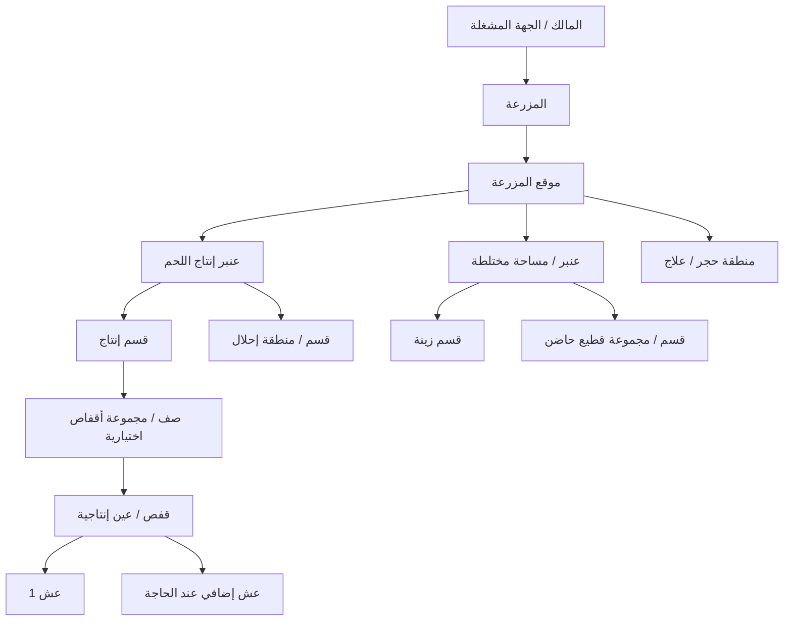

# تحليل الهيكل التشغيلي لمزرعة الحمام (Farm Structure Domain Analysis)

> **المرحلة:** Phase 2A — تحليل الهيكل التشغيلي لمزرعة الحمام  
> **الحالة:** Completed — Awaiting Review  
> **التاريخ:** 2026-08-18  
> **النطاق:** فهم الوحدات المكانية والتشغيلية للمزرعة وعلاقات الإشغال والحركة، دون تصميم قاعدة بيانات أو معمارية أو MVP.  
> **مرجع الحدود:** `09-review/domain-to-system-boundaries.md`.

---

## 1. الملخص التنفيذي

توضح Phase 2A أن مزرعة الحمام لا ينبغي وصفها بسلسلة مكانية جامدة واحدة. فالمزرعة الصغيرة قد تكون موقعًا واحدًا وعنبرًا واحدًا دون أقسام، بينما قد تحتوي مزرعة أكبر على عدة مبانٍ أو عنابر وأقسام وصفوف/مجموعات أقفاص. كما أن بعض نظم الحمام التجارية المصرية الموثقة تستخدم أبراجًا طينية أو مساكن خشبية جماعية، في حين تستخدم نظم بحثية وتجارية أخرى أقفاص أزواج فردية [SRC-002, SRC-007, SRC-008].

وبموجب `DEC-007` يبدأ المشروع من **نظام الأزواج الفردية داخل الأقفاص / العيون الإنتاجية** كنموذج تشغيل أساسي، لكنه لا يعتبر هذا النموذج حقيقة سوقية مصرية عامة.

النتيجة المركزية لهذه المرحلة هي أن الهيكل التشغيلي يجب أن يفصل بين:

1. **هوية المكان (Location Identity)** — أين يوجد الشيء؟
2. **الشاغل (Occupant)** — من يشغل المكان الآن؟
3. **الغرض التشغيلي (Operational Purpose)** — لماذا يستخدم المكان الآن؟
4. **النشاط الإنتاجي (Farm Activity)** — ما نوع النشاط الذي يخدمه المكان أو القطيع؟

وبالتالي يمكن أن يبقى القفص نفسه في مكانه بينما يتغير شاغله أو غرضه من إنتاج إلى إحلال أو عزل. ويمكن للزوج أن ينتقل مع احتفاظه بتاريخه، كما يمكن أن يبقى العش في الموقع أو يُزال/يستبدل حسب شكل التجهيز.

---

# 2. قاعدة التحليل

تطبق Phase 2A القواعد التالية:

- `Domain Entity ≠ Database Table`.
- `Information Requirement ≠ Database Field`.
- `Domain Event ≠ Software Event`.
- `Domain Status ≠ Software Enum`.
- `Project Decision ≠ Verified Fact`.
- `Benchmark ≠ Constant`.

كل الوحدات والأحداث والحالات المذكورة هنا هي **مفاهيم تشغيلية واقعية** وليست مخطط قاعدة بيانات.

---

# 3. نموذج الإسكان المعتمد كبداية

## 3.1 نموذج المشروع الأساسي

وفق `DEC-007`:

**زوج إنتاج واحد داخل قفص / عين إنتاجية فردية** هو نقطة البداية للتحليل.

هذا النموذج مدعوم بوجود أقفاص فردية مرقمة لأزواج الحمام في مزرعة تجارية مصرية ضمن دراسة حديثة [SRC-002]، وبأبحاث أخرى استخدمت زوجًا واحدًا لكل قفص أو نظم أقفاص متعددة الطبقات [SRC-008, SRC-022].

## 3.2 المرونة المطلوبة

لا يجوز أن يمنع التحليل مستقبلًا دعم:

- المسكن الجماعي (Loft).
- برج الحمام (Dovecote).
- النظام الجماعي (Colony).
- الأنظمة المختلطة (Mixed Systems).
- عمليات حمام الزينة (Fancy Pigeon Operations).
- القطعان الحاضنة / المربية البديلة (Foster / Rearing Systems).

الدراسة المصرية في الشرقية وثقت نظام الأسرة، والأبراج الطينية، والمساكن الخشبية التجارية، ما يؤكد أن الواقع المصري ليس نموذجًا مكانيًا واحدًا [SRC-007].

---

# 4. التسلسل التشغيلي الموصى به

## 4.1 النتيجة

**Recommended Operational Hierarchy**:

```text
Owner / Organization
        ↓
Farm
        ↓
Farm Site                  [اختياري عند الحاجة]
        ↓
Pigeon House / Barn        [وحدة إسكان رئيسية]
        ↓
Section / Zone             [اختياري]
        ↓
Cage Group / Row / Rack    [اختياري]
        ↓
Cage / Production Eye
        ↓
Nest(s)
```

لا يعني ذلك أن كل مزرعة يجب أن تستخدم جميع المستويات.

## 4.2 المستويات الأساسية مقابل الاختيارية

| المستوى | التقييم التشغيلي | هل يمكن الاستغناء عنه؟ |
|---|---|---|
| Owner / Organization | صاحب النشاط أو الجهة المشغلة؛ ليس مكانًا | نعم في تحليل مزرعة واحدة، لكن مهم عند تعدد المزارع |
| Farm | الوحدة التشغيلية التي يديرها صاحب النشاط كمزرعة | لا في نطاق المشروع |
| Farm Site | موقع جغرافي/تشغيلي منفصل تابع للمزرعة | نعم؛ قد يساوي Farm في المزرعة ذات الموقع الواحد |
| Pigeon House / Barn | مبنى/مسكن رئيسي للحمام | يمكن أن يندمج مع Farm في منشأة صغيرة جدًا |
| Section / Zone | تقسيم داخل المسكن لأغراض مكانية أو تشغيلية | نعم |
| Cage Group / Row / Rack | تجميع مادي للأقفاص لتسهيل الإدارة والترقيم | نعم |
| Cage / Production Eye | وحدة مكانية أساسية في نموذج الأزواج الفردية | أساسية لنموذج البداية |
| Nest | موقع التعشيش الفعلي | أساسي عند وجود تكاثر طبيعي، لكن العدد والشكل مرنان |

**مبدأ:** التسلسل أعلاه توصية تشغيلية مرنة وليس `Database Hierarchy`.

---

# 5. المزرعة (Farm) مقابل موقع المزرعة (Farm Site)

## 5.1 المزرعة

المزرعة هي الوحدة التشغيلية التي يُدار داخلها نشاط تربية الحمام كوحدة أعمال/إنتاج. وقد تشمل:

- إنتاج حمام اللحم والزغاليل؛
- حمام زينة؛
- طيور إحلال؛
- قطيع حاضن؛
- حجر صحي؛
- مناطق علاج أو عزل؛
- أكثر من عنبر أو مسكن.

## 5.2 موقع المزرعة

يصبح التفريق بين **Farm** و**Farm Site** مفيدًا عندما يكون النشاط موزعًا على أكثر من موقع فعلي أو قطعة أرض/منشأة.

في المزرعة البسيطة:

**Farm = Farm Site** عمليًا.

في النشاط متعدد المواقع:

**Farm** تمثل الوحدة التشغيلية/الإدارية، بينما **Farm Site** يمثل الموقع الجغرافي الفعلي.

لا تفترض Phase 2A أن كل عميل يحتاج مستوى `Farm Site`، لكنها تعتبره مفهومًا صالحًا عند الحاجة.

---

# 6. أنواع النشاط داخل المزرعة

يمكن أن تتعايش داخل المزرعة أنشطة مختلفة:

- إنتاج اللحم / الزغاليل (Commercial Meat / Squab Production).
- حمام الزينة (Fancy Pigeon Production).
- التربية والانتخاب الوراثي (Breeding / Genetic Selection).
- قطيع الإحلال (Replacement Stock).
- القطيع الحاضن / المربي البديل (Foster / Rearing Stock).
- نشاط مختلط (Mixed Operation).

### أين يرتبط النشاط؟

لا توجد قاعدة تلزم أن النشاط يرتبط دائمًا بالمزرعة كلها. قد يكون النشاط:

- على مستوى Farm إذا كانت المزرعة متخصصة بالكامل؛
- على مستوى Barn/Pigeon House إذا خصص مبنى كامل؛
- على مستوى Section إذا كان العنبر مختلطًا؛
- على مستوى مجموعة طيور أو أزواج عندما يكون الدور مؤقتًا مثل Emergency Foster Use.

**النتيجة:** النشاط والغرض التشغيلي لا يجب خلطهما بهوية الموقع نفسها.

---

# 7. العنبر / بيت الحمام

## 7.1 ضبط المصطلحات

المراجع تستخدم كلمات مثل:

- Pigeon House.
- Loft.
- Dovecote.
- Barn.
- Shed.

ولا تمثل هذه الكلمات تصميمًا واحدًا متطابقًا.

### الصياغة التشغيلية الموصى بها

**عنبر / بيت حمام (Pigeon House)** = المصطلح العام المحايد للوحدة الرئيسية التي تؤوي الحمام والتجهيزات المرتبطة به.

- **Loft**: يستخدم عادة لمسكن حمام جماعي، وقد يكون مبنى أو غرفة أو منشأة تحتوي طيورًا/أزواجًا متعددة.
- **Dovecote**: برج أو منشأة تقليدية مخصصة لتعشيش الحمام جماعيًا؛ وثقت الدراسة المصرية الأبراج الطينية [SRC-007].
- **Barn / Shed**: وصف مادي للمبنى/الحظيرة أكثر من كونه نظام تربية محددًا.

لا يتم اعتماد كلمة "عنبر" باعتبارها المقابل المحلي الوحيد قبل التحقق الميداني، لكنها أفضل مصطلح عام للدراسة عندما نتحدث عن وحدة إسكان رئيسية.

## 7.2 معلومات المجال المهمة للعنبر

قد يحتاج التحليل التشغيلي إلى معرفة:

- الغرض الحالي؛
- نوع/أنواع النشاط؛
- السعة المادية؛
- السعة التشغيلية الموصى بها؛
- الإشغال الحالي؛
- التهوية والإضاءة والظروف البيئية على مستوى عالٍ؛
- المسؤول التشغيلي؛
- فئة القطيع أو الفئات الموجودة؛
- حالة التشغيل والصيانة.

هذه **Domain Information Requirements** وليست Fields نهائية.

---

# 8. الأقسام داخل العنبر

## 8.1 القسم المادي (Physical Section)

جزء فعلي يمكن تمييزه مكانيًا داخل العنبر، مثل غرفة أو مساحة مفصولة بحاجز أو صفوف محددة.

## 8.2 القسم الوظيفي (Functional Section)

تخصيص تشغيلي لمساحة من أجل وظيفة مثل:

- إنتاج؛
- إحلال؛
- طيور شابة؛
- قطيع حاضن؛
- حجر صحي؛
- علاج؛
- عزل؛
- تجهيز.

قد يتطابق القسم المادي والوظيفي، وقد لا يتطابقان. ويمكن أن تتغير وظيفة القسم مع الزمن دون أن يتغير موقعه المادي.

**مبدأ:** `Physical Section ≠ Functional Purpose`.

---

# 9. مفهوم البطارية (Battery)

تم البحث عن استخدام كلمة **Battery** في أدلة الحمام، ولم يظهر دليل كافٍ يجعلها مصطلحًا معياريًا عامًا لمزارع الحمام.

المراجع الخاصة بالإنتاج المكثف تصف بدلًا من ذلك:

- نظم أقفاص متعددة الطبقات (three-tier / three-layer cage systems) [SRC-022].
- صفوفًا أو طبقات كبيرة من الأقفاص داخل loft تجاري [SRC-023].

وبالتالي توصي Phase 2A باستخدام مفهوم محايد:

**مجموعة أقفاص / صف / حامل (Cage Group / Row / Rack)**

كمستوى **اختياري** عندما توجد حاجة فعلية لتجميع الأقفاص تشغيليًا.

أما كلمة **البطارية (Battery)** نفسها فتظل:

**Requires Field Validation**

في المزارع المصرية لمعرفة هل يستخدمها المربون فعلًا، وما المقصود بها محليًا: صف، حامل، بلوك، مجموعة أقفاص، أم تركيب آخر.

---

# 10. القفص / العين الإنتاجية

## 10.1 التعريف التشغيلي

**القفص / العين الإنتاجية (Cage / Production Eye)** هو موقع إسكان محدد يمكن أن يشغله زوج أو طائر/طيور وفق الغرض التشغيلي.

في نموذج البداية المعتمد، الاستخدام النموذجي هو **زوج إنتاج واحد معروف** داخل القفص، وهو نمط مدعوم في دراسات تجارية وتجريبية [SRC-002, SRC-022].

لكن القفص كمكان قد:

- يصبح فارغًا؛
- يشغل بطائر واحد مؤقتًا؛
- يستخدم للإحلال؛
- يستخدم للعزل أو العلاج؛
- يستخدم لزوج حاضن؛
- يتغير غرضه بعد انتهاء دورة تشغيلية.

## 10.2 الهوية مقابل الغرض

**هوية القفص (Cage Identity)** ثابتة نسبيًا كمكان.

**الغرض الحالي للقفص (Current Operational Purpose)** قابل للتغيير.

**شاغل القفص (Occupant)** قابل للتغيير.

إذن:

`Cage Identity ≠ Cage Purpose ≠ Cage Occupant`

وهذا يوسع مبدأ `DEC-013` ولا يحوله إلى نموذج بيانات.

---

# 11. العش (Nest)

العش هو موقع التعشيش الفعلي المستخدم لوضع البيض والحضانة و/أو رعاية الزغاليل.

قد يكون:

- وعاء عش (Nest Bowl)؛
- صندوق عش (Nest Box)؛
- خانة عش (Nest Compartment)؛
- تجهيزًا ثابتًا داخل القفص؛
- وحدة قابلة للإزالة أو الاستبدال.

وفق `DEC-012`:

- لا يوجد عدد أعشاش ثابت لكل زوج؛
- يمكن أن يوجد عش واحد أو عشين أو أكثر حسب النظام؛
- Double Nest آلية مهمة في بعض نظم تداخل الدورات لكنها ليست إلزامية.

### العلاقة بالقفص

في نموذج الزوج الفردي غالبًا يوجد العش داخل القفص أو مرتبط به ماديًا، لكن لا يجب افتراض أن:

`Cage = Nest`

ولا أن:

`Pair always owns one permanent Nest`

عند نقل الزوج، قد يبقى العش في الموقع، أو يُنقل وعاء/صندوق، أو يُجهز عش جديد. هذه التفاصيل تحتاج تحققًا حسب تشغيل المزرعة.

---

# 12. هوية الموقع مقابل الشاغل

المبدأ المركزي لـ Phase 2A:

**هوية الموقع (Location Identity) ≠ هوية الشاغل (Occupant Identity).**

يجب التمييز مفاهيميًا بين:

- Bird Identity.
- Pair Identity.
- Cage Identity.
- Nest Identity.
- Section Identity.
- Location Identity.

مثال:

1. القفص `A-12` موجود في نفس المكان.
2. الزوج الأول يغادر القفص.
3. يدخل زوج آخر.
4. قد يتغير الغرض من إنتاج إلى إحلال ثم إلى عزل.

لم تتغير هوية المكان بسبب تغير الشاغل أو الغرض.

---

# 13. الترميز التشغيلي للمواقع

الترميز الجيد للمزرعة يجب أن يكون:

- بسيطًا للعامل؛
- مقروءًا بصريًا؛
- مستقلًا عن اسم الطائر أو الزوج؛
- لا يتغير لمجرد انتقال الطائر؛
- قابلًا للطباعة؛
- قابلًا للربط مستقبلًا بوسائل مثل QR دون أن يعتمد عليها.

### أمثلة مفاهيمية فقط

- `عنبر A → صف 3 → عين 12 → عش 1`.
- `موقع 1 / عنبر إنتاج / قسم شمال / عين 25`.

هذه الأمثلة توضح المبدأ فقط، ولا تعتمد صيغة ترميز نهائية.

---

# 14. السعة والإشغال

يجب الفصل بين ثلاثة مفاهيم:

## السعة المادية (Physical Capacity)

ما يستطيع المكان استيعابه ماديًا وفق تجهيزاته.

## السعة التشغيلية الموصى بها (Recommended Capacity)

ما ترى المزرعة أنه مناسب للتشغيل وفق الرفاهية والتهوية ونظام الإدارة والسياسة التشغيلية. لا تضع Phase 2A أرقامًا ثابتة.

## الإشغال الحالي (Current Occupancy)

ما هو موجود فعليًا الآن.

يمكن استخدام المفاهيم على مستويات Farm / Barn / Section / Cage، لكن معنى الوحدة يختلف حسب المستوى.

**Physical Capacity ≠ Recommended Capacity ≠ Current Occupancy.**

---

# 15. الحالات التشغيلية للمواقع

من الحالات الواقعية التي قد يمر بها المكان:

- فارغ؛
- مشغول؛
- محجوز/مخصص لغرض؛
- قيد التنظيف؛
- قيد التطهير؛
- قيد الصيانة؛
- خارج الخدمة؛
- مخصص للعزل أو الحجر؛
- غير صالح مؤقتًا.

هذه **أوصاف تشغيلية** وليست Software Enums معتمدة.

---

# 16. حركة الطيور داخل المزرعة

حركة الطائر حدث إداري مهم عندما تغير موقعه التشغيلي أو تؤثر في مسؤوليته/حالته الإنتاجية.

أمثلة محتملة، دون فرض Sequence ثابت:

`New Bird → Quarantine → Replacement → Breeding`

أو:

`Breeding → Treatment → Return`

أو:

`Breeding → Sale / Culling / Retirement / Death`

### معلومات المجال المطلوبة عن الحركة

- من أين تحرك؟
- إلى أين؟
- متى؟
- لماذا؟
- من اتخذ القرار أو نفذ الحركة؟
- ما الحالة التشغيلية وقت الحركة؟
- هل توجد بيض/زغاليل/علاقة زوج نشطة تتأثر بالحركة؟

هذه معلومات مجال وليست حقول قاعدة بيانات نهائية.

---

# 17. حركة الزوج

يمكن نقل الزوج كوحدة تشغيلية واحدة من قفص إلى آخر أو من قسم/عنبر إلى آخر.

وفق `DEC-010`:

**تغيير الموقع لا ينشئ زوجًا جديدًا ولا يمحو تاريخ الزوج.**

لكن النقل أثناء دورة نشطة يحتاج فهمًا إضافيًا:

- هل ينقل الزوج مع البيض؟
- هل تنقل الزغاليل؟
- هل ينتقل وعاء/صندوق العش أم يجهز عش جديد؟
- هل يسبب النقل توقفًا أو اضطرابًا؟

هذه الأسئلة لا تمنع الهيكل، وتحمل تفاصيلها إلى Phase 2C/Phase 3 عند تحليل الزوج والإنتاج.

---

# 18. تغيير وظيفة الموقع

قد يمر نفس القفص أو القسم مثلًا بالتسلسل:

`Production → Replacement → Isolation`

مع بقاء الموقع نفسه.

من منظور المجال، من المفيد الاحتفاظ بتاريخ تغير الغرض عندما يؤثر في:

- تفسير الإشغال؛
- الأمن الحيوي؛
- الأداء؛
- مسؤولية العامل؛
- سبب نقل الطيور.

لكن Phase 2A لا تحدد طريقة التخزين التقنية.

---

# 19. فئات القطيع وعلاقتها بالمواقع

| فئة القطيع | الموقع المعتاد المحتمل | ملاحظة |
|---|---|---|
| Breeding Birds / Pairs | أقفاص/عيون إنتاج أو مساكن جماعية | نموذج البداية زوج فردي لكل عين |
| Replacement Birds | قسم/أقفاص إحلال أو إسكان جماعي حسب العمر | قد لا تكون أزواجًا بعد |
| Young Birds | منطقة نمو/إحلال أو مواقع أخرى | تفاصيل الطائر إلى Phase 2B |
| Squabs | أعشاش مع الأبوين أو Foster Pair | مرتبطة بدورة الإنتاج |
| Quarantine Birds | منطقة حجر منفصلة أو مخصصة | التفاصيل الصحية إلى Phase 4 |
| Sick / Treatment Birds | عزل/علاج عند الحاجة | لا نفترض تصميم منشأة صحية الآن |
| Foster Stock | أقفاص/قسم مخصص أو أزواج مؤقتة | يمكن أن يكون Planned أو Emergency |
| Retired Birds | موقع انتظار/خروج بحسب سياسة المزرعة | ليس نموذجًا عالميًا |

---

# 20. القطيع الحاضن (Foster Stock)

وفق `DEC-018` و`DEC-019`، الحضانة/التربية الفعلية قد تختلف عن النسب الوراثي.

من ناحية الهيكل، يمكن أن يكون Foster Stock:

- في عنبر مستقل؛
- في قسم مستقل؛
- في مجموعة أقفاص مخصصة؛
- داخل نفس عنبر الإنتاج؛
- دورًا مؤقتًا لزوج عادي عند الضرورة.

لذلك لا يجب افتراض أن **Foster Stock = Dedicated Physical Section** دائمًا.

## Planned Foster Stock

قطيع أو أزواج مخطط لها أن تستقبل بيضًا/زغاليل كجزء من استراتيجية تشغيل، وهو أكثر صلة ببعض عمليات الزينة أو التربية عالية القيمة.

## Emergency Foster Use

استخدام زوج مناسب عند حدوث طارئ مثل فقد أحد الأبوين.

هذا الفرق تشغيلي، ولا يتحول الآن إلى Software Workflow أو Database Schema.

---

# 21. حمام الزينة والقطيع الحاضن

في نموذج اختياري لحمام الزينة عالي القيمة قد يظهر فصل تشغيلي مثل:

```text
Fancy Breeding Section
        ↓ produces genetic eggs
Foster / Rearing Section
        ↓ incubates / rears transferred eggs or squabs
```

لكن هذا **Secondary / Optional Operational Model** ولا يطبق تلقائيًا على مزرعة حمام اللحم.

تظل القاعدة:

`Genetic Parentage ≠ Incubating / Rearing Caregiver`.

---

# 22. سيناريو مزرعة مختلطة — اختبار صلاحية الهيكل

## السيناريو

مزرعة واحدة تحتوي على:

1. عنبر إنتاج حمام لحم.
2. قسم حمام زينة عالي القيمة.
3. قطيع حاضن.
4. منطقة إحلال.
5. منطقة حجر صحي.
6. منطقة علاج.

## تطبيق الهيكل



## ما نجح

- فصل المزرعة عن موقعها يسمح بالتوسع إلى عدة مواقع.
- العنبر والقسم يصفان النشاط المختلط دون ربط النشاط بالمزرعة كلها.
- القفص يحتفظ بهويته رغم تغير الغرض والشاغل.
- Foster Stock يمكن أن يكون قسمًا أو مجموعة أو دورًا مؤقتًا.
- تعدد الأعشاش لا يكسر الهيكل.

## ما احتاج مرونة

- Section وCage Group مستويان اختياريان.
- الحجر والعلاج قد يكونان قسمًا داخل مبنى أو منشأة منفصلة.
- Fancy/Foster قد يكونان نشاطًا أو غرضًا تشغيليًا وليس دائمًا مبنى مستقلًا.

## ما لا يجب افتراضه

- كل مزرعة لها عدة مواقع.
- كل عنبر مقسم إلى أقسام.
- كل مزرعة تستخدم مستوى Battery/Cage Group.
- كل Foster Pair في قسم مخصص.
- كل زوج له عشان.

**النتيجة:** الهيكل التشغيلي المقترح يستطيع وصف السيناريو المختلط دون فرض مستويات غير موجودة.

---

# 23. مزرعة واحدة مقابل عدة مزارع

يجب الفصل مفاهيميًا بين:

- **Owner / Organization:** مالك أو جهة تشغيل.
- **Farm:** وحدة نشاط/إدارة للمزرعة.
- **Farm Site:** موقع جغرافي فعلي عند الحاجة.

يمكن لمالك واحد تشغيل أكثر من مزرعة، ويمكن لمزرعة أكبر أن تعمل عبر أكثر من موقع. لكن Phase 2A لا تبدأ تصميم Multi-Tenant أو صلاحيات.

---

# 24. المسؤوليات التشغيلية

قد ترتبط المسؤولية التشغيلية بـ:

- Farm Manager — المزرعة كلها.
- Barn Supervisor — عنبر/بيت حمام.
- Section Supervisor — قسم أو منطقة.
- Worker — قسم، صف، مجموعة أقفاص أو مهام عبر أكثر من موقع.

تحديد المسؤول يساعد في فهم التشغيل، لكنه لا يعني Roles & Permissions برمجية في هذه المرحلة.

---

# 25. أحداث الهيكل الواقعية

من أحداث المجال المرتبطة بالهيكل:

- إنشاء/افتتاح عنبر؛
- فتح أو إغلاق قسم؛
- تغيير وظيفة قسم؛
- إضافة مجموعة أقفاص؛
- تخصيص قفص؛
- إخلاء قفص؛
- نقل طائر؛
- نقل زوج؛
- إضافة عش؛
- إزالة/استبدال عش؛
- تغيير غرض قفص؛
- إخراج قفص/قسم من الخدمة؛
- إعادة موقع للخدمة بعد صيانة/تنظيف.

هذه **Real-world Structure Events** وليست Software Events.

---

# 26. الاستثناءات المهمة

يجب أن يستطيع تحليل المجال وصف الحالات التالية:

- طائر بلا موقع ثابت أثناء نقل/فحص.
- زوج بلا قفص دائم في نظام جماعي أو أثناء إعادة التسكين.
- قفص به زوج وزغاليل.
- قفص يحتوي بيضًا منقولًا من زوج آخر.
- قفص فارغ لكنه مجهز أو محجوز.
- Foster Pair داخل قسم إنتاج عادي.
- حجر صحي مؤقت.
- نقل طائر للعلاج ثم إعادته.
- تغيير رقم/ملصق القفص دون أن يعني تغير تاريخه المكاني بالضرورة.
- تغيير وظيفة القسم.
- عطل في جزء من العنبر.
- انتقال زوج أثناء دورة إنتاج نشطة.
- عش قابل للإزالة يستبدل بينما يبقى القفص نفسه.

---

# 27. مبادئ مرونة الهيكل

بعد التحليل، تعتمد Phase 2A المبادئ التالية كـ **Domain Analysis Conclusions** لا كتصميم تقني:

1. **الموقع مستقل عن الشاغل.**
2. **الطائر قابل للنقل دون أن تتغير هويته.**
3. **الزوج قابل للنقل دون فقد تاريخه لمجرد تغيير الموقع.**
4. **الغرض التشغيلي للموقع يمكن أن يتغير مع الوقت.**
5. **عدد الأعشاش غير ثابت.**
6. **المزرعة قد تكون أحادية النشاط أو مختلطة.**
7. **Farm Site مستوى اختياري عند تعدد المواقع.**
8. **Section مستوى اختياري وقد يكون ماديًا أو وظيفيًا.**
9. **Cage Group / Row / Rack مستوى اختياري؛ لفظ Battery يحتاج تحققًا محليًا.**
10. **القطيع الحاضن قد يكون مخصصًا أو دورًا مؤقتًا.**
11. **النسب الوراثي مستقل عن موقع أو مقدم الرعاية الفعلي.**
12. **السعة المادية والسعة التشغيلية والإشغال الحالي مفاهيم مختلفة.**

---

# 28. مرساة الحضانة CON-006

لم تحاول Phase 2A حل `CON-006`.

يبقى:

**Still Open — Definition Needed**

ويحمل إلى Phase 3.

المبادئ المحفوظة فقط:

- لكل بيضة تاريخ مستقل؛
- Actual Hatch حدث فعلي؛
- Expected Hatch توقع؛
- طريقة الحساب تحدد لاحقًا؛
- لا تعتمد قاعدة عالمية `Egg Date + 18 days`.

---

# 29. التحقق الميداني المطلوب

لا تمنع النقاط التالية استمرار التحليل، لكنها تحتاج مقابلات/ملاحظة ميدانية مصرية:

1. المصطلح المحلي الشائع لـ Pigeon House/Barn/Loft في المزارع التجارية.
2. هل يستخدم مصطلح **بطارية** في الحمام؟ وما تعريفه المحلي؟
3. هل يستخدم المربون لفظ **عين** كوحدة قفص إنتاج فعلًا؟
4. هل توجد تسمية مستقلة لمجموعة الأقفاص/الصف/الحامل؟
5. نظم ترقيم العنابر والأقفاص والأعشاش الفعلية.
6. مدى استخدام أقسام مادية مقابل تخصيصات وظيفية فقط.
7. مدى انتشار Double Nest في الأقفاص الفردية.
8. مكان Foster Stock عند وجوده.
9. هل عمليات الزينة والحاضن توجد داخل نفس المزرعة أم مواقع منفصلة؟
10. طرق الحجر والعلاج والعزل الفعلية.
11. هل المزارع المستهدفة تحتاج فعليًا فصل Farm عن Farm Site؟
12. كيفية نقل الزوج عند وجود بيض/زغاليل دون إفساد الدورة.

---

# 30. مصادر Phase 2A

تعيد هذه المرحلة استخدام مصادر Phase 1 ذات الصلة، خصوصًا:

- `SRC-002` — مزرعة تجارية مصرية على طريق القاهرة–الإسكندرية: أزواج في أقفاص معدنية مرقمة.
- `SRC-005` — دراسة مصرية للحمام البلدي وفقد الأبوين ومسارات الرعاية.
- `SRC-007` — `SOCIO-ECONOMIC ANALYSIS OF PIGEON PRODUCTION SYSTEMS IN AL-SHARQIA GOVERNORATE, EGYPT`: أنظمة الأسرة والأبراج الطينية والمساكن الخشبية.
- `SRC-008` — مقارنة الأقفاص الفردية والحظائر الجماعية لإنتاج الزغاليل.

### SRC-022
- **العنوان الأصلي:** Effects of diets with different levels of protein and energy content on reproductive traits of utility-type pigeons kept in cages
- **المجلة:** European Poultry Science
- **سنة النشر:** 2000
- **الرابط:** https://www.sciencedirect.com/science/article/pii/S000390982500219X
- **الاستخدام في Phase 2A:** توثيق وجود نظام أقفاص مصمم من ثلاث طبقات مع زوج إنتاج لكل وحدة/قفص في سياق حمام اللحم.
- **القيود:** دراسة قديمة وغير مصرية؛ تستخدم لإثبات شكل هيكلي ممكن لا لإثبات الممارسة المصرية السائدة.

### SRC-023
- **العنوان الأصلي:** Pigeon cleaning behavior detection algorithm based on light-weight network
- **المجلة:** Computers and Electronics in Agriculture
- **الرابط:** https://www.sciencedirect.com/science/article/pii/S0168169922003490
- **الاستخدام في Phase 2A:** توثيق وجود منشآت حمام تجارية واسعة تحتوي أعدادًا كبيرة من الأقفاص المنظمة في صفوف/طبقات داخل loft.
- **القيود:** مصدر تقني غير مخصص لتعريف إدارة الهيكل؛ يستخدم فقط كشاهد على الترتيب المادي للأقفاص.

### تقييم الدليل الهيكلي

- وجود أكثر من نموذج إسكان: **دليل قوي**.
- استخدام قفص فردي لزوج معروف في بعض النظم: **دليل قوي**.
- وجود طبقات/صفوف/تجميعات أقفاص: **دليل قوي على إمكانية الشكل المادي**.
- اعتبار "Battery" مصطلح حمام قياسي: **دليل غير كافٍ — Requires Field Validation**.
- اعتبار الأقفاص الفردية النظام السائد في مصر: **غير مثبت — Project Direction فقط**.

---

# 31. الموضوعات المحمولة إلى المراحل التالية

## إلى Phase 2B — Pigeon & Breed Management

- ارتباط الطائر بموقع حالي دون جعل الموقع جزءًا من هويته.
- فئات القطيع: تربية، إحلال، شابة، حاضنة، معزولة، متقاعدة.
- هوية الطائر مقابل وسائل التعريف.
- الحركة بين المواقع وتأثيرها على حالة الطائر التشغيلية.
- علاقة السلالة بنوع النشاط أو القسم دون ربطها مكانيًا بشكل ثابت.

## إلى Phase 2C — Pair & Pedigree Management

- حركة الزوج دون فقد التاريخ.
- ارتباط الزوج بالقفص والعش.
- تغيير الشريك مقابل تغيير الموقع.
- Foster Pair كدور يمكن أن يكون مخططًا أو مؤقتًا.
- فصل Genetic Parentage عن Incubating / Rearing Caregiver.

## إلى Phase 3 — Production Analysis

- حركة البيض/الزغاليل بين الأزواج والمواقع.
- أثر نقل الزوج أثناء دورة نشطة.
- استخدام Nest 1 / Nest 2 مع تداخل الدورات.
- Planned Foster Transfer وEmergency Foster Transfer.
- `CON-006` وExpected Hatch policy.

## إلى Phase 4

- تفاصيل الحجر والعزل والعلاج والأمن الحيوي والرفاهية والسعة الموصى بها.

---

# 32. الأسئلة الجديدة والافتراضات والمخاطر

## أسئلة مفتوحة جديدة

**لم تُضف IDs جديدة.**

النقاط غير المحسومة في Phase 2A هي في الأساس **Field Validation Items غير حابسة**، وتم تسجيلها في القسم 29 بدل تضخيم سجل الأسئلة بأسئلة لا تمنع الانتقال.

## افتراضات جديدة

**0**.

لم تتحول توصيات الهيكل إلى Assumptions.

## مخاطر جديدة

تم تحديد خطر هيكلي جديد يجب حمله إلى سجل المخاطر:

**Rigid Hierarchy Risk:** فرض Farm → Site → Barn → Section → Cage Group → Cage → Nest بالكامل على كل مزرعة رغم أن بعض المستويات اختيارية.

---

# 33. معايير الخروج من Phase 2A

- [x] تحديد الوحدات التشغيلية الأساسية للمزرعة.
- [x] تعريف Farm / Site / Pigeon House / Section.
- [x] تحليل مفهوم Battery وعدم افتراض صلاحيته تلقائيًا.
- [x] تحليل Cage / Production Eye.
- [x] تحليل Nest وعلاقته المرنة بالقفص والزوج.
- [x] الفصل بين Location وOccupant.
- [x] تحليل السعة والإشغال.
- [x] تحليل حركة الطيور.
- [x] تحليل حركة الأزواج.
- [x] تحليل تغير وظيفة المواقع.
- [x] تحليل Foster Stock.
- [x] اختبار Mixed Farm Scenario.
- [x] تحليل أهم الاستثناءات.
- [x] تحديد Field Validation Items.
- [x] تحديد المصطلحات الجديدة المطلوبة.
- [x] تحديث MASTER وSTUDY-LOG ضمن إغلاق المرحلة.
- [x] تسجيل الخطر الهيكلي الجديد.

## النتيجة

**Phase 2A = Completed — Awaiting Review**

**Phase 2 = In Progress**

**Phase 2B = Pending**

---

# 34. الخطوة التالية الموصى بها

بعد مراجعة المستخدم فقط:

**Phase 2B — Pigeon & Breed Management Domain Analysis**

---

# شرط التوقف

توقف العمل عند نهاية Phase 2A. لم يبدأ Phase 2B أو Pair Management أو Pedigree Analysis أو Production Analysis أو Database Design أو ERD أو Architecture أو MVP أو Coding.
